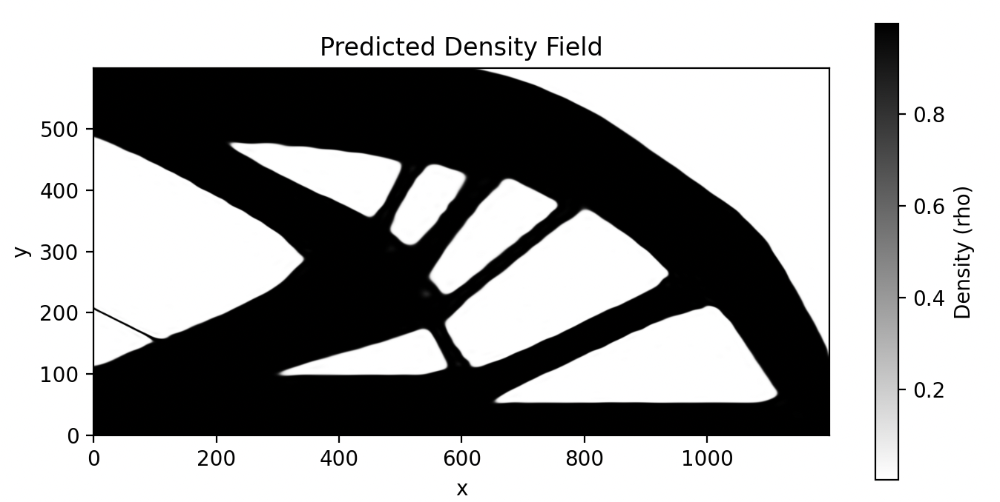

# Practical Work

## Finite Element Solvers

### Differentiable Finite Element Method with JAX: 'jax_fem'
 - biggest FEM library in jax
 - JIT does not seem to be supported
 - provides an example on how to perform TO

### A compact, high-performance finite element analysis engine built on JAX:  "feax"
 - supports jit
 - will require more effort to get to work, examples are not up-to-date with the current codebase
 - provides an example on how to perform TO

### Not investigated:
 - Grid-based approximation of partial differential equations in Julia: "Gridap.jl"
 - taichi
 - https://github.com/meyer-nils/torch-fem

## Siren

### JAX implementation of SIREN using Equinox: github project: [(equinox-siren)](https://github.com/sukjulian/equinox-siren)
 -  JIT compatibily to be evaluated it
 -  works quite well (tested with jax_fem)

### Not investigated:
- [Pytorch implementation of SIREN - Implicit Neural Representations with Periodic Activation Function](https://github.com/lucidrains/siren-pytorch)
- [Pytorch implementation from the original SIREN paper](https://github.com/scart97/Siren-fastai2/blob/master/siren.py)
- For Julia: could be implemented in flux with (some) effort

## TOuNN Authors
 - since the original paper, they have made several projects based on some form of TO
   - [TOuNN github project](https://github.com/UW-ERSL/TOuNN)
   - written in pytorch
 - A JAX implementation of TOuNN was created 2 years later
   - [JAXTOuNN](https://github.com/UW-ERSL/JAXTOuNN)
   - uses standard mlp with LeakyRELU
 - Since then their other projects that go into TO have also been implemeted using JAX:
   - [AuTO](https://github.com/UW-ERSL/AuTO)
 - Expanding into Fluidic Problems:
   - [TOFLUX](https://github.com/UW-ERSL/TOFLUX)
   - [FluTO](https://github.com/UW-ERSL/FluTO)
   - [TOMAS](https://github.com/UW-ERSL/TOMAS)

## SIREN-based implicit density representation (using jax-fem) of the basic TO problem:

